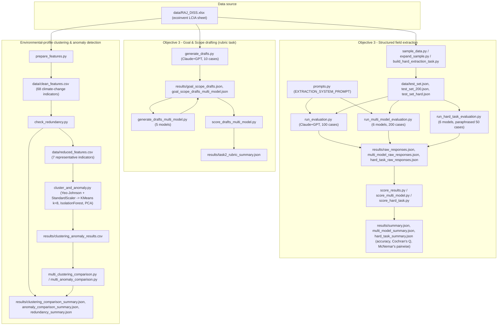

# Raj-Dissertation

MSc Applied AI dissertation project by Raj Khatik, *"Understanding the Role of Artificial Intelligence in Life Cycle Assessment"*, WMG, University of Warwick, supervised by Dr. You Wu, completed September 2026. This repository holds the technical evaluation component of the dissertation: an LLM benchmarking pipeline that tests how accurately large language models (Claude, GPT, Gemini, Llama, GPT-OSS) can extract structured Life Cycle Inventory (LCI) fields from natural-language descriptions of ecoinvent activities, alongside a complementary unsupervised-learning pipeline that clusters those same activities by environmental impact profile and flags statistical anomalies.

## Stack

- **openpyxl** — reading the raw ecoinvent LCIA Excel workbook (`RAJ_DISS.xlsx`)
- **pandas** — data loading, sampling, feature/CSV handling
- **openai** — GPT-4o-mini / GPT-5.6 Terra API calls
- **anthropic** — Claude Haiku 4.5 API calls
- **python-dotenv** — loading API keys from `.env`
- (used by individual scripts, not pinned in `requirements.txt`) **google-genai** for Gemini 3.5 Flash, **groq** for Llama 3.3 70B and GPT-OSS 120B, **scikit-learn** (KMeans, IsolationForest, PCA, StandardScaler/PowerTransformer) for clustering/anomaly detection, **scipy** (Cochran's Q, McNemar's, binomial tests) for significance testing

## Architecture

## Repository structure

- **`data/`** — the raw ecoinvent LCIA workbook (`RAJ_DISS.xlsx`, gitignored), derived feature CSVs (`clean_features.csv`, `reduced_features.csv`), and generated LLM test sets (`test_set.json`, `test_set_200.json`, `test_set_hard.json`) built by the sampling scripts.
- **`scripts/`** — the pipeline code: test-set builders, prompt templates, per-model API call wrappers (Claude/GPT/Gemini/Llama/GPT-OSS), scoring/statistical-testing scripts for the extraction and drafting tasks, and the feature-preparation/clustering/anomaly-detection scripts for the environmental-profile analysis.
- **`results/`** — all pipeline outputs: raw and parsed model responses, accuracy/statistical-test summaries (Cochran's Q, Bonferroni-corrected McNemar's), goal-and-scope draft text and rubric scores, clustering/anomaly CSVs, and the indicator correlation/redundancy analysis.
